# Copilot Agent Pipelines — Architecture & Design

> **Audience**: Engineers evaluating, extending, or debugging the agent pipeline system.
> Novice-friendly explanations with full technical depth for advanced users.

This document describes the three orchestration pipelines that power automated development in this repository. Each pipeline is a **prompt file** (`.github/prompts/*.prompt.md`) that turns GitHub Copilot's chat agent into a multi-agent orchestrator — dispatching specialized sub-agents to plan, build, validate, and review code changes.

---

## Table of Contents

- [System Overview](#system-overview)
- [Key Concepts](#key-concepts)
- [Pipeline 1: plan\_to\_build](#pipeline-1-plan_to_build)
- [Pipeline 2: build](#pipeline-2-build)
- [Pipeline 3: bug\_to\_pr](#pipeline-3-bug_to_pr)
- [Agent Registry](#agent-registry)
- [Guardrails & Safety Nets](#guardrails--safety-nets)
- [Engineering Philosophy — Skills Embedded in Pipelines](#engineering-philosophy--skills-embedded-in-pipelines)
- [File Map](#file-map)
- [FAQ](#faq)

---

## System Overview

The system follows a **hub-and-spoke orchestration model**: the main Copilot chat agent acts as the orchestrator (hub), and stateless sub-agents (spokes) do the actual work. Sub-agents cannot talk to each other — all communication flows through the orchestrator.

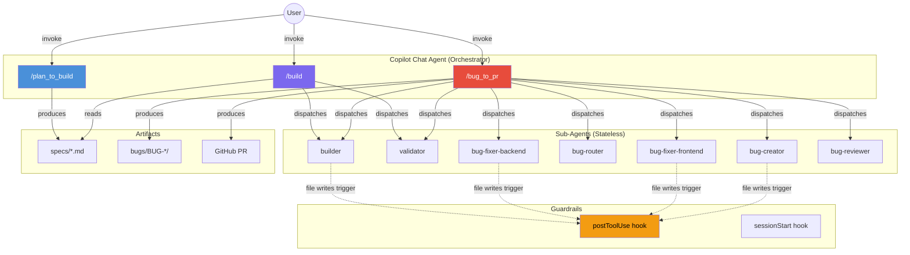

### How It Works (Plain English)

1. **You describe what you want** — a feature, a bug fix, a task.
2. **A pipeline takes over** — it reads your request, dispatches specialized agents, validates their work, and produces artifacts (specs, code, PRs).
3. **Each agent does one thing** — a builder writes code, a validator checks it, a reviewer judges it. They never freelance.
4. **Guardrails catch mistakes** — hooks automatically lint Python, typecheck TypeScript, and validate document structure on every file write.

---

## Key Concepts

| Concept              | What It Means                                                                                                                                                  |
| -------------------- | -------------------------------------------------------------------------------------------------------------------------------------------------------------- |
| **Orchestrator**     | The main Copilot chat agent. It reads prompts, dispatches sub-agents via `runSubagent()`, and makes sequencing decisions. It never writes implementation code. |
| **Sub-Agent**        | A stateless agent (defined in `.github/agents/*.agent.md`) that receives a task, executes it, and returns a structured report. Cannot talk to other agents.    |
| **Prompt File**      | A `.prompt.md` file in `.github/prompts/` that defines a pipeline's behavior. Invoked via `/command` in Copilot Chat.                                          |
| **Spec File**        | A plan document in `specs/` that fully describes what to build, who builds it, and how to validate it. The bridge between planning and execution.              |
| **TDD Preamble**     | Instructions prepended to every builder dispatch: write a failing test first (RED), implement minimally (GREEN), then refactor.                                |
| **Fix Cycle**        | When a validator reports FAIL, the builder is re-dispatched with the failure context. Max 2 fix cycles per task before rollback.                               |
| **Rollback**         | If a task fails after 2 fix cycles, `git checkout` reverts its changes. Broken code never stays in the codebase.                                               |
| **postToolUse Hook** | A Python script that runs after every file write — lints `.py` files, typechecks `.ts/.tsx` files, and validates spec/report structure.                        |

---

## Pipeline 1: plan_to_build

**File**: `.github/prompts/plan_to_build.prompt.md`
**Purpose**: Turn a user's feature request into a detailed, agent-executable specification.
**Output**: `specs/<descriptive-name>.md`

This pipeline is **planning only** — it reads code, asks clarifying questions, and writes a spec document. It never modifies source code.

### Flow

```mermaid
flowchart LR
    A["User describes\nfeature/task"] --> B["Analyze\nRequirements"]
    B --> C["Explore Codebase\n(read, grep, search)"]
    C --> D{"Brainstorm?\n(feature/enhancement)"}
    D -->|"Yes"| E["Ask user:\nWhich approach?"]
    D -->|"Skip"| F["Design\nSolution"]
    E --> F
    F --> G{"Team\nComposition?"}
    G -->|"Medium/Complex"| H["Ask user:\nHow many builders?"]
    G -->|"Simple"| I["Single builder"]
    H --> I
    I --> J["Write tasks\n(50+ words each)"]
    J --> K["Self-Audit\n(counts & rules)"]
    K --> L["Save to\nspecs/*.md"]
    L --> M["Verify\n(file exists + 7 sections)"]
    M --> N["Spec Ready"]

    style A fill:#4A90D9,color:#fff
    style N fill:#27AE60,color:#fff
    style K fill:#F39C12,color:#000
    style M fill:#F39C12,color:#000
```

### What the Spec Contains

Every spec has **7 required sections** (enforced by the postToolUse hook):

| Section                  | Purpose                                           |
| ------------------------ | ------------------------------------------------- |
| `## Task Description`    | What needs to be done and why                     |
| `## Objective`           | Measurable definition of "done"                   |
| `## Relevant Files`      | Exact file paths involved                         |
| `## Step by Step Tasks`  | Ordered tasks with IDs, dependencies, assignments |
| `## Acceptance Criteria` | Specific, verifiable outcomes                     |
| `## Team Orchestration`  | Team composition and execution model              |
| `### Team Members`       | Named builders and validators with roles          |

### Quality Rules

These rules ensure specs are executable by stateless agents:

- **Task size**: 2–5 minutes of work, ~20 lines max. "Implement user authentication" is too big — split it.
- **Description minimum**: ≥50 words per task. One-liners are forbidden.
- **Design assertions**: Every route/model/component task needs 2–3 structural test assertions, not just "it works."
- **Intermediate validators**: Plans with >5 builder tasks need checkpoint validators between phases.
- **Self-audit**: Before saving, count tasks, verify word counts, check validator frequency.

### Example: How a Task Looks in a Spec

```markdown
### 3. Add validation error response
- **Task ID**: add-validation-error
- **Role**: builder
- **Depends On**: create-pydantic-model
- **Assigned To**: builder-1
- **Description**: |
    Add Pydantic validation to the POST /metrics endpoint in backend/main.py.
    Create a MetricCreate model in backend/models.py with fields: name (str, required),
    value (float, required), tags (dict[str,str], optional, default_factory=dict).
    Follow the existing MetricOut model pattern. The route should return 422 for
    invalid input. Verify with: cd backend && pytest tests/test_api.py -v -k test_create
```

---

## Pipeline 2: build

**File**: `.github/prompts/build.prompt.md`
**Purpose**: Execute a spec by dispatching builder and validator sub-agents in dependency order.
**Input**: A spec file from `specs/`
**Output**: Implemented, tested, validated code changes.

This pipeline is the **execution engine**. It reads a plan, dispatches agents one at a time, and handles success, failure, fix cycles, and rollbacks.

### Flow

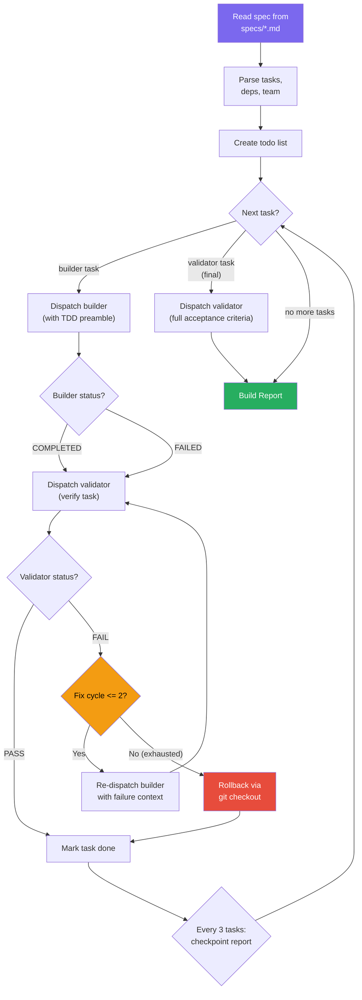

### The TDD Preamble

Every builder dispatch includes these mandatory instructions:

```
1. Write a FAILING test FIRST (RED)
2. Write MINIMAL implementation to pass (GREEN)
3. Refactor if needed, confirm still GREEN
```

This ensures test-driven development at the agent level — tests always exist before implementation.

### Fix Cycle Mechanics

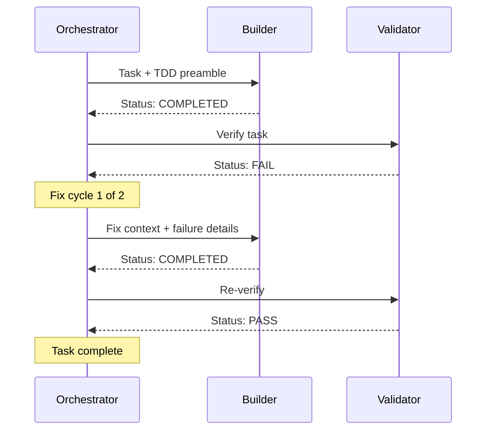

If the validator still reports FAIL after 2 fix cycles:

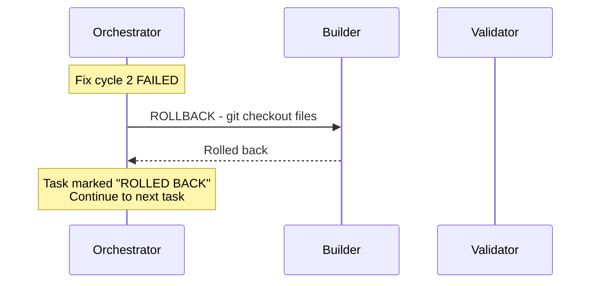

### Checkpoints

After every 3 builder tasks, the orchestrator pauses and reports progress. This gives the user visibility and a chance to course-correct.

### Orchestrator Rules

| Rule                           | Why                                              |
| ------------------------------ | ------------------------------------------------ |
| Never implement code yourself  | All code goes through `runSubagent("builder")`   |
| Never run validation yourself  | All checks go through `runSubagent("validator")` |
| Never skip validation          | Every builder task is followed by a validator    |
| Never say "done" without proof | Final report includes actual command output      |
| Max 2 fix cycles per task      | Prevents infinite loops on unfixable problems    |
| Rollback on exhausted cycles   | Broken code is never left in the codebase        |

---

## Pipeline 3: bug_to_pr

**File**: `.github/prompts/bug_to_pr.prompt.md`
**Purpose**: Take a bug description and produce a reviewed, merged GitHub PR — fully automated.
**Input**: A bug description from the user
**Output**: A merged PR with bug report, test evidence, and review verdicts attached.

This is the most complex pipeline — it orchestrates **7 different agents** across **6 phases**, embeds the full `build` protocol for fix execution, implements adversarial code review with isolation guarantees, and handles crash recovery.

### End-to-End Flow

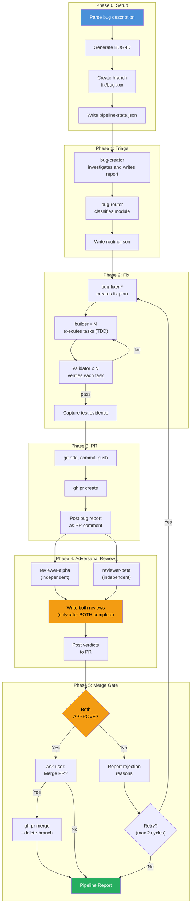

### Phase Details

#### Phase 0 — Setup
Creates the bug directory (`bugs/BUG-XXX/`), a git branch (`fix/bug-xxx`), and initializes the pipeline state file for crash recovery.

#### Phase 1 — Triage
The **bug-creator** agent reads the codebase, attempts to reproduce the bug, and writes a JIRA-format report with 8 required sections. The **bug-router** agent (read-only) classifies which module owns the bug and which fixer agent should handle it.

#### Phase 2 — Fix (Nested Orchestration)
This is where the `plan_to_build` + `build` pipelines run *inside* the bug pipeline:

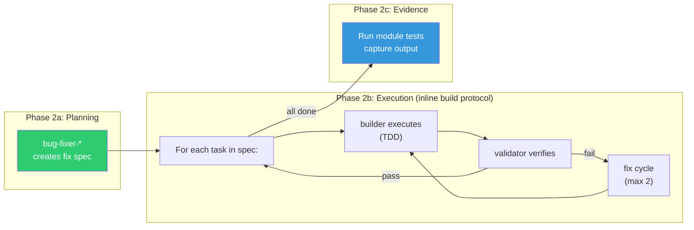

#### Phase 3 — PR Creation
Commits all changes, pushes the branch, creates a GitHub PR via `gh` CLI, and posts the bug report as a PR comment.

#### Phase 4 — Adversarial Review (Isolation Protocol)

Two independent reviewers evaluate the fix against a **5-point checklist**:

1. Root cause addressed?
2. No regressions introduced?
3. Test evidence sufficient?
4. Edge cases covered?
5. Fix is minimal?

**The isolation guarantee**: Review files are written to disk **only after both reviewers complete**. When reviewer-alpha runs, beta's file doesn't exist on the filesystem (and vice versa). This is a structural guarantee, not just a prompt instruction.

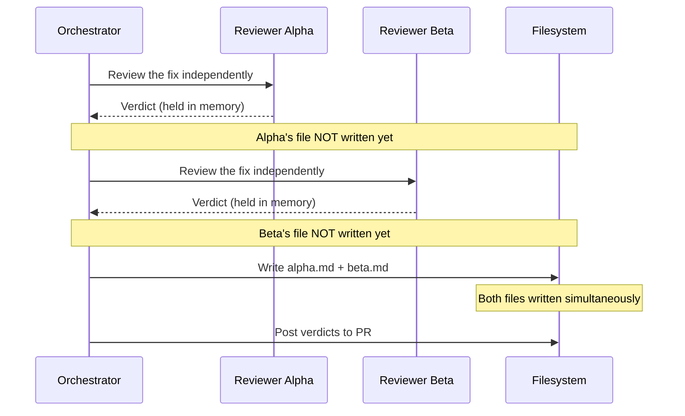

#### Phase 5 — Merge Gate
If both reviewers approve, the user is asked for final confirmation before merging. If either rejects, the pipeline can re-enter the fix phase with rejection feedback (up to 2 fix-review cycles total).

### Crash Recovery

The pipeline writes a `pipeline-state.json` checkpoint after each phase:

```json
{
  "bug_id": "BUG-001",
  "phase": "triage",
  "branch": "fix/bug-001",
  "fix_cycle": 0,
  "module": "frontend",
  "fixer_agent": "bug-fixer-frontend"
}
```

On resume, the orchestrator reads this file and skips completed phases. All filesystem artifacts (reports, plans, test results) survive crashes.

### Fix-Review Cycles

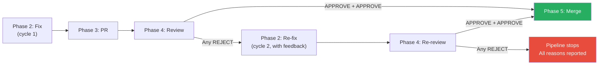

---

## Agent Registry

All agents are defined in `.github/agents/` and share these traits:
- **Stateless**: Each invocation starts fresh — no memory of previous tasks.
- **Structured reports**: Every agent ends with a parseable status (`COMPLETED`/`FAILED` for builders, `PASS`/`FAIL` for validators).
- **Scoped**: Each agent has a defined purpose and stays within it.

| Agent                  | File                          | Type       | Purpose                                                               |
| ---------------------- | ----------------------------- | ---------- | --------------------------------------------------------------------- |
| **builder**            | `builder.agent.md`            | Read-write | Implements one task with TDD. Writes tests first, then code.          |
| **validator**          | `validator.agent.md`          | Read-only* | Verifies a task was completed. Runs commands, shows actual output.    |
| **bug-creator**        | `bug-creator.agent.md`        | Read-write | Investigates bugs, writes JIRA-format reports (8 required sections).  |
| **bug-router**         | `bug-router.agent.md`         | Read-only  | Classifies which module owns a bug. Outputs JSON routing decision.    |
| **bug-fixer-backend**  | `bug-fixer-backend.agent.md`  | Read-write | Creates fix plans for `backend/` bugs in `plan_to_build` format.      |
| **bug-fixer-frontend** | `bug-fixer-frontend.agent.md` | Read-write | Creates fix plans for `frontend/src/` bugs in `plan_to_build` format. |
| **bug-reviewer**       | `bug-reviewer.agent.md`       | Read-only  | Adversarial 5-point reviewer. Returns APPROVE or REJECT verdict.      |

*\* Validator runs commands to check work but does not modify source files.*

### Module Registry

The module registry (`.github/bug-modules.json`) maps code areas to agents:

```json
{
  "modules": {
    "backend":  { "fixer": "bug-fixer-backend",  "paths": ["backend/"],       "test_command": "cd backend && pytest tests/ -v" },
    "frontend": { "fixer": "bug-fixer-frontend", "paths": ["frontend/src/"], "test_command": "cd frontend && npm test -- --run" }
  },
  "default_fixer": "bug-fixer-backend"
}
```

---

## Guardrails & Safety Nets

The system has multiple layers of automated protection. Some are system-enforced (hooks), others are protocol-enforced (prompt instructions + orchestrator discipline).

### Layer 1: postToolUse Hook (System-Enforced)

**File**: `.github/hooks/validators/post_tool_validator.py`
**Trigger**: Every file write by any agent.

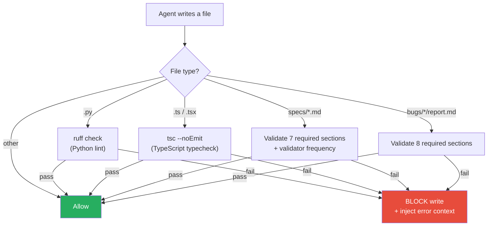

**What it catches:**
| Check                    | Trigger                            | Action on Failure                              |
| ------------------------ | ---------------------------------- | ---------------------------------------------- |
| Python lint              | Any `.py` file write               | Blocks write, shows ruff errors                |
| TypeScript typecheck     | Any `.ts`/`.tsx` file write        | Blocks write, shows tsc errors                 |
| Spec section validation  | Any `specs/*.md` write             | Blocks if any of 7 sections missing            |
| Spec validator frequency | `specs/*.md` with >5 builder tasks | Blocks if insufficient intermediate validators |
| Bug report validation    | Any `bugs/*/report.md` write       | Blocks if any of 8 sections missing            |

### Layer 2: sessionStart Hook

**File**: `.github/hooks/setup.sh`
**Trigger**: Every new Copilot chat session.
**Action**: Installs Python and Node dependencies automatically. Agents never fail due to missing packages.

### Layer 3: Orchestrator Protocol (Prompt-Enforced)

| Rule                                                    | Enforced By                | Pipeline         |
| ------------------------------------------------------- | -------------------------- | ---------------- |
| Orchestrator never writes code                          | Prompt instructions        | build, bug_to_pr |
| Every builder task gets a validator                     | Prompt instructions        | build, bug_to_pr |
| Max 2 fix cycles, then rollback                         | Prompt instructions        | build, bug_to_pr |
| Review files written only after both reviewers complete | Structural design + prompt | bug_to_pr        |
| `pipeline-state.json` updated after each phase          | Prompt instructions        | bug_to_pr        |
| Working directory reset at start of each phase          | Prompt instructions        | bug_to_pr        |
| User confirmation required before merge                 | `ask_questions` call       | bug_to_pr        |
| Checkpoint reports every 3 builder tasks                | Prompt instructions        | build, bug_to_pr |

### Layer 4: Spec Quality Rules (Plan-Time)

| Rule                    | Description                                                      |
| ----------------------- | ---------------------------------------------------------------- |
| ≥50 words per task      | One-line descriptions are forbidden                              |
| Design assertions       | 2–3 structural test assertions per route/model/component task    |
| Intermediate validators | Required when builder count > 5                                  |
| Self-audit before save  | Count tasks, verify word counts, check validator frequency       |
| Brainstorm gate         | Non-trivial features require approach discussion before planning |

### Layer 5: instructions/ (Always-On)

**File**: `.github/instructions/team-orchestration.instructions.md`
**Scope**: Applies to all files in `specs/**/*.md`
**Effect**: Reinforces that spec files are planning-only — never write implementation code in a plan.

---

## Engineering Philosophy — Skills Embedded in Pipelines

The pipelines aren't ad-hoc automation. They encode the team's **engineering skills** (`.github/skills/`) directly into agent behavior. Each skill defines a philosophy (mandatory practices, forbidden anti-patterns) — and those rules are baked into the prompts and agents as concrete, enforceable instructions.

This means agents don't just "write code" — they follow the same engineering standards a senior engineer would, automatically.

### Skill → Pipeline Mapping

| Skill                              | Embedded In                                                              | Key Rules Extracted                                                               |
| ---------------------------------- | ------------------------------------------------------------------------ | --------------------------------------------------------------------------------- |
| **brainstorming**                  | `plan_to_build` prompt — "Prerequisite: Explore Before Planning" section | One question at a time, multiple-choice preferred, skip table for trivial tasks   |
| **writing-plans**                  | `plan_to_build` prompt — "Task Quality Rules" section                    | ≥50 word descriptions, 2–5 min task size, design assertions, self-audit checklist |
| **plan-reviewer**                  | `plan_to_build` prompt — Workflow step 8 "Self-Review"                   | Gap analysis: missing deps, risky areas, edge cases, rollback paths               |
| **test-driven-development**        | `builder` agent + `build` prompt builder preamble                        | RED-GREEN-REFACTOR cycle, test-first is mandatory, skip table for config          |
| **terminal-discipline**            | `builder` agent                                                          | No interrupting running commands, note long durations, read full output           |
| **systematic-debugging**           | `builder` agent + `build` prompt fix cycle dispatch                      | 4-phase: reproduce → isolate → root cause → fix. No random changes.               |
| **verification-before-completion** | `validator` agent + `build` prompt report section                        | Never say PASS without actual output, paste real command results                  |
| **safe-rollback**                  | `build` prompt — exhausted fix cycle handler                             | `git checkout` rollback when 2 fix cycles fail, verify with `git diff`            |
| **executing-plans**                | `build` prompt — batch checkpoints                                       | Pause every 3 tasks, report progress, give user a chance to course-correct        |
| **code-refactoring**               | `plan_to_build` prompt — task splitting rules                            | "Too Big" test: >2 files or >20 lines = split it                                  |
| **requesting-code-review**         | `bug_to_pr` prompt — Phase 4 adversarial review                          | Independent dual reviewers, 5-point checklist, structural isolation               |
| **finishing-a-development-branch** | `bug_to_pr` prompt — Phase 5 merge gate                                  | User confirmation before merge, clean branch deletion                             |

### How This Works in Practice

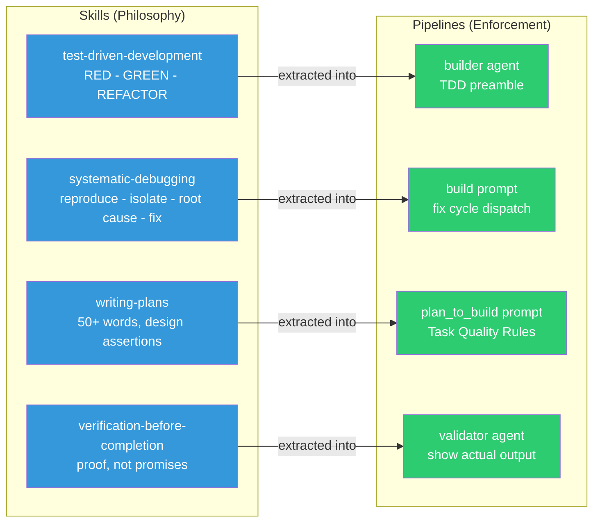

The skills directory contains ~30 skills covering everything from Rust database architecture to Playwright automation. Not all apply to this project — but the ones that do are **compiled into** the pipeline prompts and agent instructions, turning philosophy into automated enforcement.

---

## File Map

```
.github/
├── agents/                          # Agent definitions
│   ├── builder.agent.md             # Implements tasks with TDD
│   ├── validator.agent.md           # Verifies task completion
│   ├── bug-creator.agent.md         # Writes bug reports
│   ├── bug-router.agent.md          # Classifies bug modules
│   ├── bug-fixer-backend.agent.md   # Plans backend fixes
│   ├── bug-fixer-frontend.agent.md  # Plans frontend fixes
│   └── bug-reviewer.agent.md        # Adversarial code reviewer
│
├── hooks/
│   ├── hooks.json                   # Hook configuration
│   ├── setup.sh                     # sessionStart: install deps
│   └── validators/
│       └── post_tool_validator.py   # postToolUse: lint, typecheck, section validation
│
├── instructions/
│   └── team-orchestration.instructions.md  # Always-on planning rules
│
├── prompts/
│   ├── plan_to_build.prompt.md      # Pipeline 1: planning
│   ├── build.prompt.md              # Pipeline 2: execution
│   └── bug_to_pr.prompt.md          # Pipeline 3: end-to-end bug fix
│
├── bug-modules.json                 # Module → agent mapping
└── copilot-instructions.md          # Global project conventions

specs/                               # Generated plan documents
bugs/                                # Generated bug artifacts
├── BUG-XXX/
│   ├── report.md                    # JIRA-format bug report
│   ├── routing.json                 # Module classification
│   ├── test-results.md              # Captured test output
│   ├── pipeline-state.json          # Crash recovery checkpoint
│   ├── verdict.json                 # Merge gate decision
│   └── reviews/
│       ├── alpha.md                 # Reviewer alpha verdict
│       └── beta.md                  # Reviewer beta verdict
```

---

## FAQ

### How do I use these pipelines?

In VS Code with Copilot Chat in **Agent mode**:

| To do this...        | Type this...                                                          |
| -------------------- | --------------------------------------------------------------------- |
| Plan a feature       | `/plan_to_build "add metric history endpoint"`                        |
| Execute a plan       | `execute the plan in specs/add-metric-history.md` (uses build prompt) |
| Fix a bug end-to-end | `/bug_to_pr "alerts panel flickers when metrics refresh"`             |

### Can agents talk to each other?

No. All sub-agents are stateless and communicate only with the orchestrator. The filesystem is their shared state — one agent's file writes are visible to the next agent dispatched.

### What happens if an agent fails?

The orchestrator handles it:
1. **Builder fails validation** → re-dispatched with failure context (up to 2 fix cycles)
2. **Fix cycles exhausted** → `git checkout` rollback, task skipped, pipeline continues
3. **Reviewer rejects** → pipeline can re-enter fix phase with feedback (up to 2 cycles)
4. **Pipeline crashes** → `pipeline-state.json` preserves progress; resume from last checkpoint

### Why two reviewers?

Adversarial review catches issues a single reviewer might miss. The isolation protocol ensures independent judgment — neither reviewer can see the other's verdict until both are done.

### What's the difference from Claude Code's version?

This system was ported from Claude Code slash commands. Key differences:

| Capability          | Claude Code                | Copilot                    |
| ------------------- | -------------------------- | -------------------------- |
| Agent communication | `SendMessage` (direct)     | Orchestrator mediates all  |
| Parallel execution  | `run_in_background`        | Sequential only            |
| Tool restrictions   | `disallowedTools` (system) | Prompt-enforced            |
| Review isolation    | `PreToolUse` hook (system) | Structural + prompt        |
| Session persistence | Built-in resume            | `pipeline-state.json` file |
| Sub-agent nesting   | Agents call Skills         | Orchestrator bridges       |

The Copilot version achieves equivalent outcomes through different mechanisms — structural design and protocol discipline replace system-level enforcement.

### How do I add a new module?

1. Add an entry to `.github/bug-modules.json` with `fixer`, `paths`, and `test_command`
2. Create `.github/agents/bug-fixer-<module>.agent.md` following the existing fixer pattern
3. The bug-router will automatically include the new module in its classification
